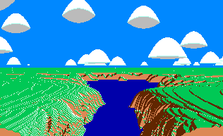

# Apfelsee

a Python learning experience using a simple 3d fractal renderer as an example. So far, it's astonishing how dog slow Python is at this task. Java can run this in realtime with 20-40fps.

